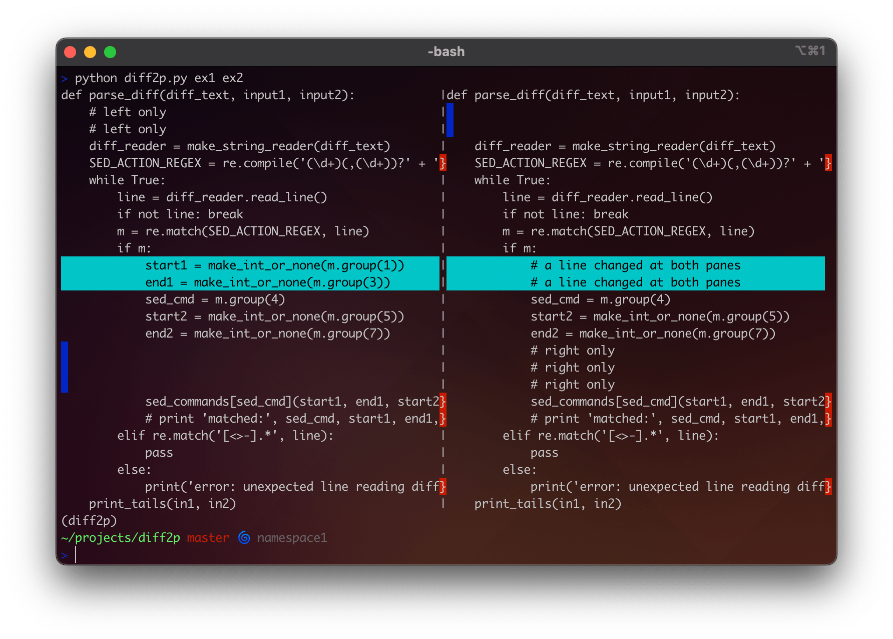

# diff2p

A two-panel diff tool working with terminals.
Written in 2004 while working as QA in Sun's St. Petersburg office. 

## Requirments

- Python 3.9 is fine
- A coloured terminal

## Usage

```shell
python diff2p.py file1 file2
python diff2p.py file1 file2 | less -R
```


